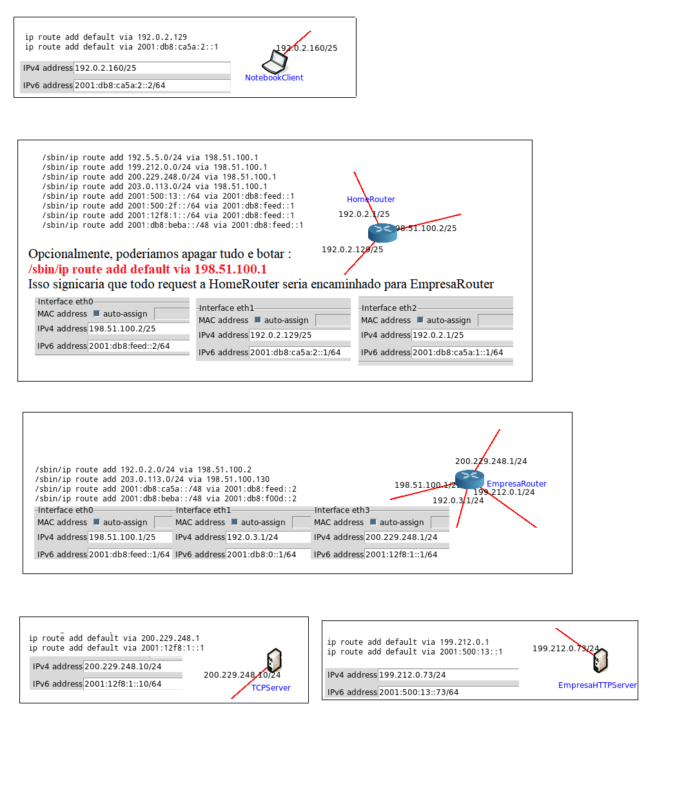

# Topologia da Rede está em empresa.imn 
- Aquivo do Emulador Core que simboliza a topologia de rede da empresa é ``empresa.imn``
[]

# Hosts Servidor
- Hosts cotendo ``-ilustrativo`` no nome , é porque não exibe comportamento de servidor de verdade
- Já os outros são servidores, o que serve paginas html da empresa é o host ``EmpresaHTTPServer``, esse host roda o codigo do arquivo ``httpserver.py`` dessa repo, devolvendo ao usuario o conteudo de ``ganhamu.html`` dessa repo.
- TCPServer roda o código ``tcpserver.py`` desse repo.

# Testando Cliente
- Rode ``python cliente.py``shell do host ``NotebookClient`` para se connectar ao host server ``TCPServer``

- Rode ``wget http://199.212.0.73:80``shell do host ``EmpresaHTTPServer``
- Em seguinda, rode ``cat index.html`` pra ver o html recebido da EmpresaHTTPServer

# Configuration for Routers/Hosts/Servers

